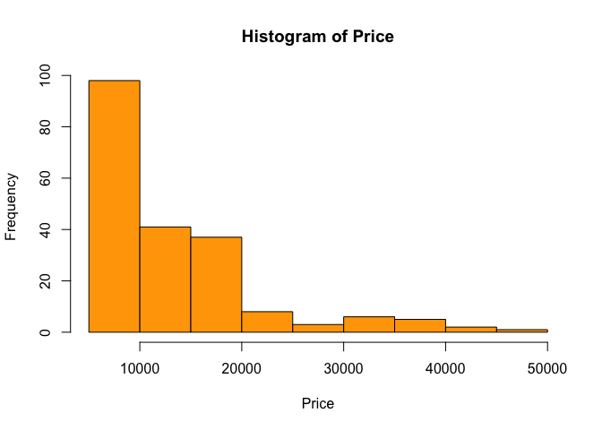
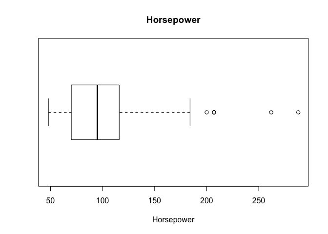
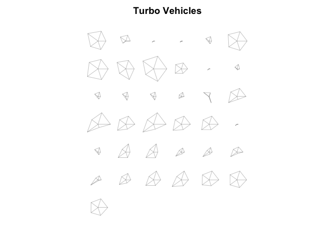
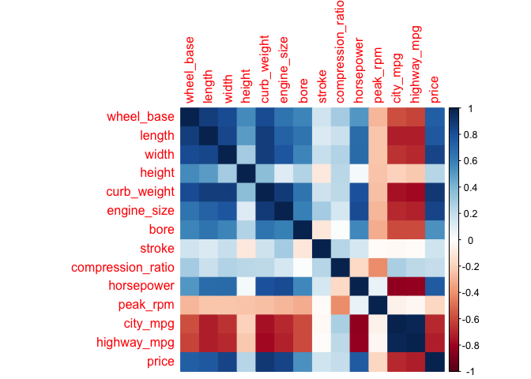
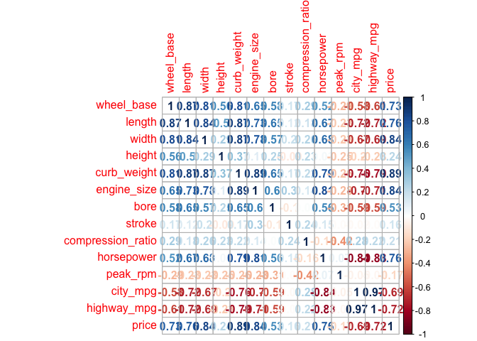
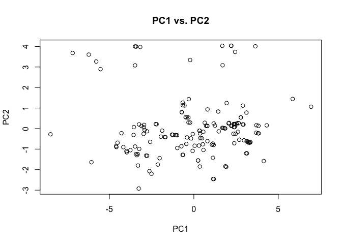
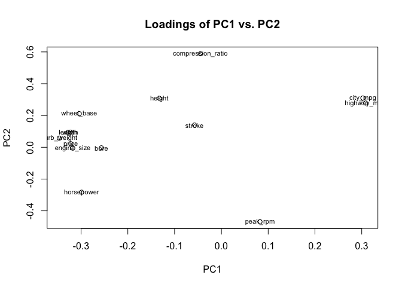

Homework 1 Ian Driscoll
================

### 1. Data Dictionary

The file 'imports-85-dictionary.md' has been created in the hw01 directory and specifies what each of the variables mean.

### 2. Data Import

``` r
library(readr)
names = c('symboling', 'normalized_losses', 'make', 'fuel_type', 'aspiration', 'num_of_doors', 'body_style', 'drive_wheels', 'engine_location', 'wheel_base', 'length', 'width', 'height', 'curb_weight', 'engine_type', 'num_of_cylinders', 'engine_size', 'fuel_system', 'bore', 'stroke', 'compression_ratio', 'horsepower', 'peak_rpm', 'city_mpg', 'highway_mpg', 'price')
dat = read_csv('imports-85.data', col_names = names, col_types = 'ddcccccccddddiccicdddiiiii', na = c('?'))
str(dat)
```

    ## Classes 'tbl_df', 'tbl' and 'data.frame':    205 obs. of  26 variables:
    ##  $ symboling        : num  3 3 1 2 2 2 1 1 1 0 ...
    ##  $ normalized_losses: num  NA NA NA 164 164 NA 158 NA 158 NA ...
    ##  $ make             : chr  "alfa-romero" "alfa-romero" "alfa-romero" "audi" ...
    ##  $ fuel_type        : chr  "gas" "gas" "gas" "gas" ...
    ##  $ aspiration       : chr  "std" "std" "std" "std" ...
    ##  $ num_of_doors     : chr  "two" "two" "two" "four" ...
    ##  $ body_style       : chr  "convertible" "convertible" "hatchback" "sedan" ...
    ##  $ drive_wheels     : chr  "rwd" "rwd" "rwd" "fwd" ...
    ##  $ engine_location  : chr  "front" "front" "front" "front" ...
    ##  $ wheel_base       : num  88.6 88.6 94.5 99.8 99.4 ...
    ##  $ length           : num  169 169 171 177 177 ...
    ##  $ width            : num  64.1 64.1 65.5 66.2 66.4 66.3 71.4 71.4 71.4 67.9 ...
    ##  $ height           : num  48.8 48.8 52.4 54.3 54.3 53.1 55.7 55.7 55.9 52 ...
    ##  $ curb_weight      : int  2548 2548 2823 2337 2824 2507 2844 2954 3086 3053 ...
    ##  $ engine_type      : chr  "dohc" "dohc" "ohcv" "ohc" ...
    ##  $ num_of_cylinders : chr  "four" "four" "six" "four" ...
    ##  $ engine_size      : int  130 130 152 109 136 136 136 136 131 131 ...
    ##  $ fuel_system      : chr  "mpfi" "mpfi" "mpfi" "mpfi" ...
    ##  $ bore             : num  3.47 3.47 2.68 3.19 3.19 3.19 3.19 3.19 3.13 3.13 ...
    ##  $ stroke           : num  2.68 2.68 3.47 3.4 3.4 3.4 3.4 3.4 3.4 3.4 ...
    ##  $ compression_ratio: num  9 9 9 10 8 8.5 8.5 8.5 8.3 7 ...
    ##  $ horsepower       : int  111 111 154 102 115 110 110 110 140 160 ...
    ##  $ peak_rpm         : int  5000 5000 5000 5500 5500 5500 5500 5500 5500 5500 ...
    ##  $ city_mpg         : int  21 21 19 24 18 19 19 19 17 16 ...
    ##  $ highway_mpg      : int  27 27 26 30 22 25 25 25 20 22 ...
    ##  $ price            : int  13495 16500 16500 13950 17450 15250 17710 18920 23875 NA ...
    ##  - attr(*, "spec")=List of 2
    ##   ..$ cols   :List of 26
    ##   .. ..$ symboling        : list()
    ##   .. .. ..- attr(*, "class")= chr  "collector_double" "collector"
    ##   .. ..$ normalized_losses: list()
    ##   .. .. ..- attr(*, "class")= chr  "collector_double" "collector"
    ##   .. ..$ make             : list()
    ##   .. .. ..- attr(*, "class")= chr  "collector_character" "collector"
    ##   .. ..$ fuel_type        : list()
    ##   .. .. ..- attr(*, "class")= chr  "collector_character" "collector"
    ##   .. ..$ aspiration       : list()
    ##   .. .. ..- attr(*, "class")= chr  "collector_character" "collector"
    ##   .. ..$ num_of_doors     : list()
    ##   .. .. ..- attr(*, "class")= chr  "collector_character" "collector"
    ##   .. ..$ body_style       : list()
    ##   .. .. ..- attr(*, "class")= chr  "collector_character" "collector"
    ##   .. ..$ drive_wheels     : list()
    ##   .. .. ..- attr(*, "class")= chr  "collector_character" "collector"
    ##   .. ..$ engine_location  : list()
    ##   .. .. ..- attr(*, "class")= chr  "collector_character" "collector"
    ##   .. ..$ wheel_base       : list()
    ##   .. .. ..- attr(*, "class")= chr  "collector_double" "collector"
    ##   .. ..$ length           : list()
    ##   .. .. ..- attr(*, "class")= chr  "collector_double" "collector"
    ##   .. ..$ width            : list()
    ##   .. .. ..- attr(*, "class")= chr  "collector_double" "collector"
    ##   .. ..$ height           : list()
    ##   .. .. ..- attr(*, "class")= chr  "collector_double" "collector"
    ##   .. ..$ curb_weight      : list()
    ##   .. .. ..- attr(*, "class")= chr  "collector_integer" "collector"
    ##   .. ..$ engine_type      : list()
    ##   .. .. ..- attr(*, "class")= chr  "collector_character" "collector"
    ##   .. ..$ num_of_cylinders : list()
    ##   .. .. ..- attr(*, "class")= chr  "collector_character" "collector"
    ##   .. ..$ engine_size      : list()
    ##   .. .. ..- attr(*, "class")= chr  "collector_integer" "collector"
    ##   .. ..$ fuel_system      : list()
    ##   .. .. ..- attr(*, "class")= chr  "collector_character" "collector"
    ##   .. ..$ bore             : list()
    ##   .. .. ..- attr(*, "class")= chr  "collector_double" "collector"
    ##   .. ..$ stroke           : list()
    ##   .. .. ..- attr(*, "class")= chr  "collector_double" "collector"
    ##   .. ..$ compression_ratio: list()
    ##   .. .. ..- attr(*, "class")= chr  "collector_double" "collector"
    ##   .. ..$ horsepower       : list()
    ##   .. .. ..- attr(*, "class")= chr  "collector_integer" "collector"
    ##   .. ..$ peak_rpm         : list()
    ##   .. .. ..- attr(*, "class")= chr  "collector_integer" "collector"
    ##   .. ..$ city_mpg         : list()
    ##   .. .. ..- attr(*, "class")= chr  "collector_integer" "collector"
    ##   .. ..$ highway_mpg      : list()
    ##   .. .. ..- attr(*, "class")= chr  "collector_integer" "collector"
    ##   .. ..$ price            : list()
    ##   .. .. ..- attr(*, "class")= chr  "collector_integer" "collector"
    ##   ..$ default: list()
    ##   .. ..- attr(*, "class")= chr  "collector_guess" "collector"
    ##   ..- attr(*, "class")= chr "col_spec"

### 3. Technical Questions About Importing Data

1.  When you call read.csv('imports-85.data'), the names of the columns will default to the first entry in the column. If the value is an integer or numeric value, it will read "X(value)", the exact chzracter string if it is a character, and X. if it is a missing value.

2.  If you set header to FALSE, the labels for the columns become V1, V2, V3, ... until the last column.

3.  These columns are coerced into characters if there are missing values if strongsAsFactors is set to FALSE, and are coerced to factors if not.

4.  When the values are specified for data types of columns, the missing values make errors and are converted from "?" to "NA" which increases the overall file size.

5.  An R matrix can only be one data type for all columns and values, so everything would be converted to a character. Because the data is not all integers or numerics, they all are converted to characters.

### 4. Practice Base Plotting

``` r
hist(dat$price, col = 'Orange', xlab = 'Price', main = 'Histogram of Price')
```



``` r
boxplot(dat$horsepower, horizontal = TRUE, main = 'Horsepower', xlab = 'Horsepower')
```



``` r
bs_table = table(dat$body_style)
bs_data_frame = as.data.frame(bs_table)
bs_ordered = bs_data_frame[order(bs_data_frame$Freq, decreasing = TRUE), ]
barplot(bs_ordered$Freq, width = 1.8, xlim = c(0, 10), ylim = c(0, 120), names.arg = bs_ordered$Var1)
```


``` r
turbo = dat[dat$aspiration == 'turbo', c('wheel_base', 'length', 'width', 'height', 'price')]
stars(turbo, main = 'Turbo Vehicles')
```



### 5. Summaries

``` r
# a.
gas_price = dat[dat$fuel_type == 'gas' & !is.na(dat$price), 'price']
mean(gas_price$price)
```

    ## [1] 12916.41

``` r
# b.
twelve_cyl = dat[dat$num_of_cylinders == 'twelve', 'make']
twelve_cyl$make[1]
```

    ## [1] "jaguar"

``` r
# c.
diesel = dat[dat$fuel_type == 'diesel',]
diesel_table = table(diesel$make)
diesel_df = as.data.frame(diesel_table, stringsAsFactors = FALSE)
diesel_df_ordered = diesel_df[order(diesel_df$Freq, decreasing = TRUE), ]
diesel_df_ordered$Var1[1]
```

    ## [1] "peugot"

``` r
# d.
hp_ordered = dat[order(dat$horsepower, decreasing = TRUE), ]
hp_ordered$price[1]
```

    ## [1] NA

``` r
# The price for the largest horsepower is missing, so I will check the second highest horsepower.
hp_ordered$price[2]
```

    ## [1] 36000

``` r
# e.
quantile(dat$city_mpg, probs = 0.1)
```

    ## 10% 
    ##  17

``` r
# f.
quantile(dat$highway_mpg, probs = 0.9)
```

    ## 90% 
    ##  38

``` r
# g.
price_10th = dat[dat$city_mpg <= 17 & !is.na(dat$price), 'price']
median(price_10th$price)
```

    ## [1] 32250

### 6. Technical Questions About Data Frames

1.  The output would return NULL since it does not exist, and a waarning message would be displayed saying the column specified is unknown or uninitialised.

2.  The fourth command would result in an error.

3.  Since R is treating mpg as a variable, not the string title of a column, the object would not be found, causing an error when trying to call it.

4.  Yes yoou can, but it does not translate directly to a data frame. A list is essentially one value, so a list column would essentially have one row. If a data frame is made with other columns of longer length, the list is copied to each row, and the list is further split up into separate columns for each entry in the list.

5.  You can convert a data frame to a list, and it becomes a list with a length of the number of columns, and each entry in the list is a list itself, made up of the entries for each column.

6.  One function you could use is as.data.frame(abc). Another function that would work is data.frame(label = abc).

### 7. Correlations of Quantitative Variables

``` r
library(corrplot)
```

    ## corrplot 0.84 loaded

``` r
qdat = na.omit(dat)[ , c('wheel_base', 'length', 'width', 'height', 'curb_weight', 'engine_size', 'bore', 'stroke', 'compression_ratio', 'horsepower', 'peak_rpm', 'city_mpg', 'highway_mpg', 'price')]
correlation = cor(qdat)
# color visualization
corrplot(correlation, method = "color")
```



``` r
# number visualization
corrplot(correlation, method = "number")
```



Looking at the visualizations of the correlation matrix, it appears that price is positively correlated with many of the physical characteristics such as length, width, and height. However, city\_mpg and highway\_mpg appear to be negatively correlated with those attributes, suggesting an inverse correlation between price and mpg, which is apparent in the -0.69 and -0.72 correlations with between the mpg's and price.

### 8. Principal Component Analyis

``` r
pca = prcomp(qdat, scale. = TRUE)
pca
```

    ## Standard deviations (1, .., p=14):
    ##  [1] 2.7893300 1.4304187 1.1481105 0.9419293 0.7519724 0.6252615 0.5255315
    ##  [8] 0.4707962 0.3844961 0.3494949 0.2990447 0.2934624 0.2140144 0.1502369
    ## 
    ## Rotation (n x k) = (14 x 14):
    ##                           PC1          PC2         PC3          PC4
    ## wheel_base        -0.30376522  0.211570786 -0.09883696  0.232284921
    ## length            -0.32784651  0.093363781 -0.10666376  0.158748964
    ## width             -0.32299316  0.095078418  0.08762298  0.032561771
    ## height            -0.13267767  0.308011568 -0.48012878  0.538360608
    ## curb_weight       -0.34641354  0.057570293  0.04460159 -0.009478582
    ## engine_size       -0.31774889 -0.005432083  0.24052823 -0.229485509
    ## bore              -0.25659050 -0.003519805 -0.25722848 -0.379586202
    ## stroke            -0.05740035  0.139848035  0.71033962  0.275412488
    ## compression_ratio -0.04498602  0.588238255  0.20426935  0.015441668
    ## horsepower        -0.29877623 -0.282831777  0.14999212 -0.074249960
    ## peak_rpm           0.08249888 -0.468613434  0.12806124  0.589027058
    ## city_mpg           0.30239595  0.310003247  0.08128611 -0.042967658
    ## highway_mpg        0.30830938  0.278359635  0.08332044 -0.049682346
    ## price             -0.32190091  0.022216167  0.12604629 -0.015490969
    ##                           PC5         PC6         PC7           PC8
    ## wheel_base        -0.03305829  0.13471441 -0.46941922  0.0791646361
    ## length            -0.03545358  0.11471183 -0.22590671 -0.0627321900
    ## width              0.20365805  0.02504407 -0.47854885 -0.0009957428
    ## height            -0.25613697 -0.14907294  0.40328233  0.1986555251
    ## curb_weight        0.09409899 -0.09399521  0.15402792  0.0635008228
    ## engine_size       -0.03173848 -0.15201135  0.21326836  0.2864295571
    ## bore              -0.20348415  0.77083767  0.17455111  0.0599802661
    ## stroke            -0.57668641  0.14873187  0.03755584 -0.0460727895
    ## compression_ratio  0.47911504  0.16828442  0.34364836 -0.4535685365
    ## horsepower         0.06288059 -0.02812635  0.31194883  0.1757539143
    ## peak_rpm           0.39132004  0.42816879  0.10584403  0.0976200193
    ## city_mpg           0.12354194  0.13946037 -0.04938785  0.4747529922
    ## highway_mpg        0.06524331  0.16404673 -0.07363624  0.5010160006
    ## price              0.31713816 -0.19694942  0.03753549  0.3687642653
    ##                           PC9        PC10         PC11        PC12
    ## wheel_base        -0.05040311  0.58438727  0.001292497 -0.45099962
    ## length             0.60456280  0.03146058  0.171446958  0.59024484
    ## width             -0.09587596 -0.72715998 -0.187477952 -0.17248171
    ## height            -0.07900716 -0.22819761 -0.051901589 -0.06943457
    ## curb_weight        0.05214998  0.06330651 -0.236534252  0.06858438
    ## engine_size        0.11110358  0.17083975 -0.645725633  0.07391217
    ## bore              -0.21703971 -0.06827910  0.027254975  0.04088402
    ## stroke            -0.12634013 -0.06776911  0.111552065  0.04853530
    ## compression_ratio  0.04657819  0.05117024  0.031154707 -0.07447778
    ## horsepower         0.44649767 -0.12289806  0.428376292 -0.51831600
    ## peak_rpm          -0.03341591  0.04312767 -0.210721863  0.06961662
    ## city_mpg           0.09557457 -0.02964855 -0.054797953 -0.09370057
    ## highway_mpg        0.24169635 -0.06556362  0.082910373  0.07017776
    ## price             -0.51787970  0.09724917  0.455969580  0.32664302
    ##                            PC13         PC14
    ## wheel_base        -0.0431501513 -0.063749388
    ## length            -0.0886332222  0.160348737
    ## width             -0.0558389655 -0.028529232
    ## height            -0.1061344884 -0.012018089
    ## curb_weight        0.8667797366 -0.102326856
    ## engine_size       -0.4157096147 -0.008906740
    ## bore               0.0001385919  0.007202743
    ## stroke             0.0514376960  0.022179626
    ## compression_ratio -0.1253584961 -0.035747640
    ## horsepower        -0.0430474660  0.036149428
    ## peak_rpm          -0.0240614612 -0.015638797
    ## city_mpg           0.1435913473  0.706431194
    ## highway_mpg        0.0146107251 -0.675066682
    ## price             -0.1007646078  0.024139437

``` r
eigenvalues = pca$sdev^2
percentage = (eigenvalues / sum(eigenvalues)) * 100
cum_percent = cumsum(percentage)
eigenframe = data.frame(eigenvalue = eigenvalues, percentage = percentage, cum_percent = cum_percent
)
eigenframe
```

    ##    eigenvalue percentage cum_percent
    ## 1  7.78036168 55.5740120    55.57401
    ## 2  2.04609771 14.6149837    70.18900
    ## 3  1.31815775  9.4154125    79.60441
    ## 4  0.88723082  6.3373630    85.94177
    ## 5  0.56546244  4.0390174    89.98079
    ## 6  0.39095199  2.7925142    92.77330
    ## 7  0.27618337  1.9727384    94.74604
    ## 8  0.22164907  1.5832077    96.32925
    ## 9  0.14783726  1.0559805    97.38523
    ## 10 0.12214670  0.8724764    98.25771
    ## 11 0.08942773  0.6387695    98.89648
    ## 12 0.08612020  0.6151443    99.51162
    ## 13 0.04580215  0.3271582    99.83878
    ## 14 0.02257113  0.1612224   100.00000

``` r
eigenframe$cum_percent[3]
```

    ## [1] 79.60441

``` r
# First two components plot
plot(pca$x, main = 'PC1 vs. PC2')
```



``` r
# First two loadings plot
plot(pca$rotation[,1], pca$rotation[,2], xlab = 'PC1', ylab = 'PC2', main = 'Loadings of PC1 vs. PC2')
text(pca$rotation[,1], pca$rotation[,2], labels=names(qdat), cex= 0.7)
```



Looking at the first scatterplot, it appears that most of the scores are clustered around 0 for both variables, but there is a larger proportion of variables with higher than average PC2 scores. In the second scatterplot we can see that many of the variables are around clustered around 0 for PC2, but around -0.3 for PC1.
