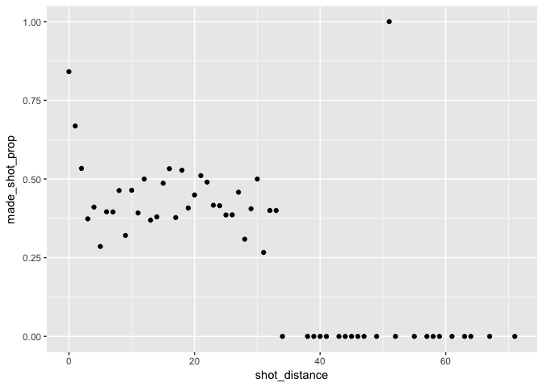
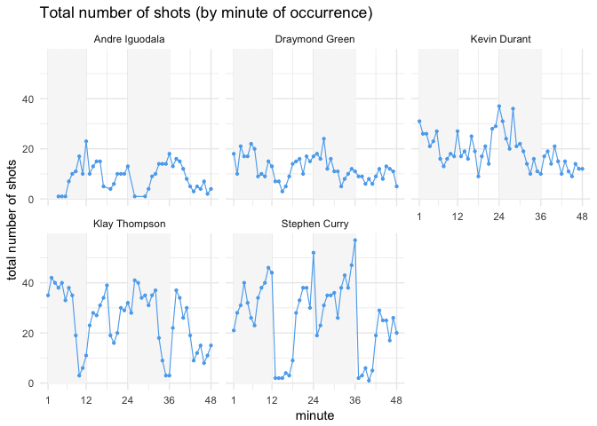

HW 02 - Shot Charts
================
Ian Driscoll

5. Effective Percentages
------------------------

``` r
library(dplyr)
```

    ## 
    ## Attaching package: 'dplyr'

    ## The following objects are masked from 'package:stats':
    ## 
    ##     filter, lag

    ## The following objects are masked from 'package:base':
    ## 
    ##     intersect, setdiff, setequal, union

``` r
library(ggplot2)
dat = read.csv('../data/shots-data.csv')

# table of players and total shot attempts

dat %>%
  group_by(name) %>%
  summarise(total = n()) %>%
  arrange(desc(total))
```

    ## # A tibble: 5 x 2
    ##   name           total
    ##   <fct>          <int>
    ## 1 Stephen Curry   1250
    ## 2 Klay Thompson   1220
    ## 3 Kevin Durant     915
    ## 4 Draymond Green   578
    ## 5 Andre Iguodala   371

``` r
# table with player, total shot attempts, made shot, and percentage 

iggy = nrow(filter(dat, name == 'Andre Iguodala' & shot_made_flag == 'made shot'))
green = nrow(filter(dat, name == 'Draymond Green' & shot_made_flag == 'made shot'))
durant = nrow(filter(dat, name == 'Kevin Durant' & shot_made_flag == 'made shot'))
thompson = nrow(filter(dat, name == 'Klay Thompson' & shot_made_flag == 'made shot'))
curry = nrow(filter(dat, name == 'Stephen Curry' & shot_made_flag == 'made shot'))
made_shots = c(iggy, green, durant, thompson, curry)

dat %>%
  group_by(name) %>%
  summarise(total = n()) %>%
  mutate(made = made_shots) %>%
  mutate(perc_made = made / total) %>%
  arrange(desc(perc_made))
```

    ## # A tibble: 5 x 4
    ##   name           total  made perc_made
    ##   <fct>          <int> <int>     <dbl>
    ## 1 Kevin Durant     915   495     0.541
    ## 2 Andre Iguodala   371   192     0.518
    ## 3 Klay Thompson   1220   575     0.471
    ## 4 Stephen Curry   1250   584     0.467
    ## 5 Draymond Green   578   245     0.424

``` r
# 2 point shooting percentage

iggy2 = nrow(filter(dat, name == 'Andre Iguodala' & shot_made_flag == 'made shot' & shot_type == '2PT Field Goal'))
green2 = nrow(filter(dat, name == 'Draymond Green' & shot_made_flag == 'made shot' & shot_type == '2PT Field Goal'))
durant2 = nrow(filter(dat, name == 'Kevin Durant' & shot_made_flag == 'made shot' & shot_type == '2PT Field Goal'))
thompson2 = nrow(filter(dat, name == 'Klay Thompson' & shot_made_flag == 'made shot' & shot_type == '2PT Field Goal'))
curry2 = nrow(filter(dat, name == 'Stephen Curry' & shot_made_flag == 'made shot' & shot_type == '2PT Field Goal'))
made_shots2 = c(iggy2, green2, durant2, thompson2, curry2)

dat %>%
  group_by(name) %>%
  filter(shot_type == '2PT Field Goal') %>%
  summarise(total = n()) %>%
  mutate(made = made_shots2) %>%
  mutate(perc_made = made / total) %>%
  arrange(desc(perc_made))
```

    ## # A tibble: 5 x 4
    ##   name           total  made perc_made
    ##   <fct>          <int> <int>     <dbl>
    ## 1 Andre Iguodala   210   134     0.638
    ## 2 Kevin Durant     643   390     0.607
    ## 3 Stephen Curry    563   304     0.540
    ## 4 Klay Thompson    640   329     0.514
    ## 5 Draymond Green   346   171     0.494

``` r
# 3 point shooting percentage

iggy3 = nrow(filter(dat, name == 'Andre Iguodala' & shot_made_flag == 'made shot' & shot_type == '3PT Field Goal'))
green3 = nrow(filter(dat, name == 'Draymond Green' & shot_made_flag == 'made shot' & shot_type == '3PT Field Goal'))
durant3 = nrow(filter(dat, name == 'Kevin Durant' & shot_made_flag == 'made shot' & shot_type == '3PT Field Goal'))
thompson3 = nrow(filter(dat, name == 'Klay Thompson' & shot_made_flag == 'made shot' & shot_type == '3PT Field Goal'))
curry3 = nrow(filter(dat, name == 'Stephen Curry' & shot_made_flag == 'made shot' & shot_type == '3PT Field Goal'))
made_shots3 = c(iggy3, green3, durant3, thompson3, curry3)

dat %>%
  group_by(name) %>%
  filter(shot_type == '3PT Field Goal') %>%
  summarise(total = n()) %>%
  mutate(made = made_shots3) %>%
  mutate(perc_made = made / total) %>%
  arrange(desc(perc_made))
```

    ## # A tibble: 5 x 4
    ##   name           total  made perc_made
    ##   <fct>          <int> <int>     <dbl>
    ## 1 Klay Thompson    580   246     0.424
    ## 2 Stephen Curry    687   280     0.408
    ## 3 Kevin Durant     272   105     0.386
    ## 4 Andre Iguodala   161    58     0.360
    ## 5 Draymond Green   232    74     0.319

6. Shooting Distances
=====================

``` r
a = dat %>%
  group_by(shot_distance) %>%
  summarise(made_shot_prop = length(shot_made_flag[shot_made_flag=="made shot"]) / n())
  
ggplot(data = a) + geom_point(aes(x = shot_distance, y = made_shot_prop))
```



From the plot we can observe that as distance increased, proportion does go down for the most part. It appears that beyond 32-34 feet the chance of making a shot drops to practically zero. Distances within 3 feet, and a few distances between 16 and 22 feet have over a 50 percent chance of a shot being made.

7. Total Shots by Minute of Occurrence
======================================

``` r
player_distances = dat %>%
  group_by(name, minute) %>%
  summarise(total_shots = n())

ggplot(data = player_distances) + 
  geom_rect(aes(xmin = 1, ymin = 0, xmax = 12, ymax = Inf), fill = 'grey97') + 
  geom_rect(aes(xmin = 24, ymin = 0, xmax = 36, ymax = Inf), fill = 'grey97') + 
  geom_point(aes(x = minute, y = total_shots), color = 'steelblue2', size = 0.8) + 
  facet_wrap(~ name) + 
  geom_path(aes(x = minute, y = total_shots), color = 'steelblue2', size = 0.4) + 
  theme_minimal() + 
  scale_x_continuous(breaks = c(1, 12, 24, 36, 48)) + 
  ggtitle('Total number of shots (by minute of occurrence)') + 
  xlab('minute') + 
  ylab('total number of shots')
```


