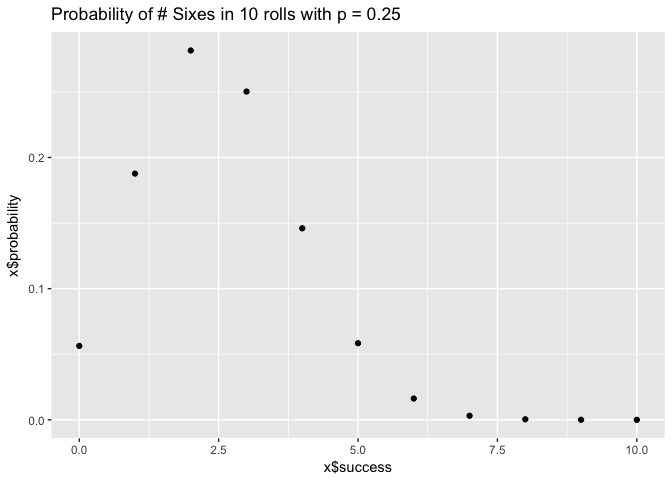
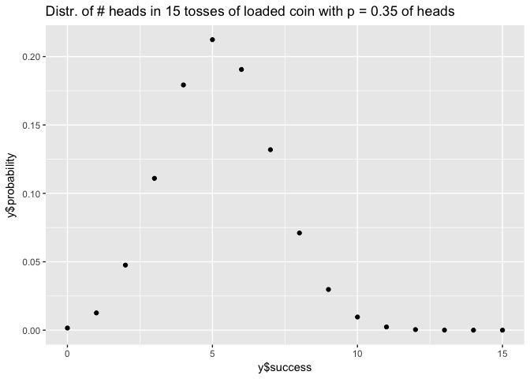

hw03-ian-driscoll
================

Pipelines and Redirection using bash
------------------------------------

### 2.1 Unique teams

``` bash
cut -d "," -f 2 nba2017-roster.csv | tail +2 | sort -u > team-names.txt
head -n 5 team-names.txt
```

    ## "ATL"
    ## "BOS"
    ## "BRK"
    ## "CHI"
    ## "CHO"

### 2.2 Unique positions

``` bash
cut -d "," -f 3 nba2017-roster.csv | tail +2 | sort -u > position-names.txt
head -n 5 position-names.txt
```

    ## "C"
    ## "PF"
    ## "PG"
    ## "SF"
    ## "SG"

### 2.3 Counts of experiences sorted

``` bash
cut -d "," -f 7 nba2017-roster.csv | tail +2 | sort -n | uniq -c > experience-counts.txt
head -n 5 experience-counts.txt
```

    ##   80 0
    ##   52 1
    ##   46 2
    ##   36 3
    ##   35 4

### 2.4 Clippers players

``` bash
grep -e "team" -e "LAC" nba2017-roster.csv > LAC.csv
cat LAC.csv
```

    ## "player","team","position","height","weight","age","experience","salary"
    ## "Alan Anderson","LAC","SF",78,220,34,7,1315448
    ## "Austin Rivers","LAC","SG",76,200,24,4,1.1e+07
    ## "Blake Griffin","LAC","PF",82,251,27,6,20140838
    ## "Brandon Bass","LAC","PF",80,250,31,11,1551659
    ## "Brice Johnson","LAC","PF",82,230,22,0,1273920
    ## "Chris Paul","LAC","PG",72,175,31,11,22868828
    ## "DeAndre Jordan","LAC","C",83,265,28,8,21165675
    ## "Diamond Stone","LAC","C",83,255,19,0,543471
    ## "J.J. Redick","LAC","SG",76,190,32,10,7377500
    ## "Jamal Crawford","LAC","SG",77,200,36,16,13253012
    ## "Luc Mbah a Moute","LAC","SF",80,230,30,8,2203000
    ## "Marreese Speights","LAC","C",82,255,29,8,1403611
    ## "Paul Pierce","LAC","SF",79,235,39,18,3500000
    ## "Raymond Felton","LAC","PG",73,205,32,11,1551659
    ## "Wesley Johnson","LAC","SF",79,215,29,6,5628000

### 2.5 Lakers age counts

``` bash
grep "LAL" nba2017-roster.csv | cut -d "," -f 6 | sort -n | uniq -c
```

    ##    2 19
    ##    1 20
    ##    2 22
    ##    3 24
    ##    2 25
    ##    2 30
    ##    2 31
    ##    1 37

### 2.6 Number of Cleveland players

``` bash
cut -d "," -f 2 nba2017-roster.csv | grep "CLE" | wc -l
```

    ##       15

### 2.7 Warriors names, heights, and weights

``` bash
grep -e "GSW" -e "team" nba2017-roster.csv | cut -d "," -f 1,4,5 > gsw-height-weight.csv
cat gsw-height-weight.csv
```

    ## "player","height","weight"
    ## "Andre Iguodala",78,215
    ## "Damian Jones",84,245
    ## "David West",81,250
    ## "Draymond Green",79,230
    ## "Ian Clark",75,175
    ## "James Michael McAdoo",81,230
    ## "JaVale McGee",84,270
    ## "Kevin Durant",81,240
    ## "Kevon Looney",81,220
    ## "Klay Thompson",79,215
    ## "Matt Barnes",79,226
    ## "Patrick McCaw",79,185
    ## "Shaun Livingston",79,192
    ## "Stephen Curry",75,190
    ## "Zaza Pachulia",83,270

### 2.8 Top 10 salaries

``` bash
grep -e "player" nba2017-roster.csv | cut -d "," -f 1,8 > top10-salaries.csv
cut -d "," -f 1,8 nba2017-roster.csv | sort -t "," -n -r -k2 >> top10-salaries.csv
cat top10-salaries.csv | head -n 11
```

    ## "player","salary"
    ## "LeBron James",30963450
    ## "Russell Westbrook",26540100
    ## "Mike Conley",26540100
    ## "Kevin Durant",26540100
    ## "James Harden",26540100
    ## "DeMar DeRozan",26540100
    ## "Al Horford",26540100
    ## "Carmelo Anthony",24559380
    ## "Damian Lillard",24328425
    ## "Dwyane Wade",23200000

Binomial Functions
------------------

``` r
source('code/binomial-functions.R')
library(ggplot2)
# probability of geting 3 sixes in 10 rolls
bin_probability(10, 3, (1/6))
```

    ## [1] 0.1550454

``` r
# prob plot of number of sixes with loaded die in 10 rolls
x = bin_distribution(10, 0.25)
ggplot() + geom_point(aes(x = x$success, y = x$probability)) + ggtitle("Probability of # Sixes in 10 rolls with p = 0.25")
```



``` r
# probability of more than 3 heads in 5 tosses with biased coin of p = 0.35 of heads
prob = 0
for (i in 4:5) {
  prob = prob + bin_probability(5, i, 0.35)
}
prob
```

    ## [1] 0.0540225

``` r
# distribution of # heads in 15 tosses of loaded coin with p = 0.35 of heads
y = bin_distribution(15, 0.35)
ggplot() + geom_point(aes(x = y$success, y = y$probability)) + ggtitle("Distr. of # heads in 15 tosses of loaded coin with p = 0.35 of heads")
```


