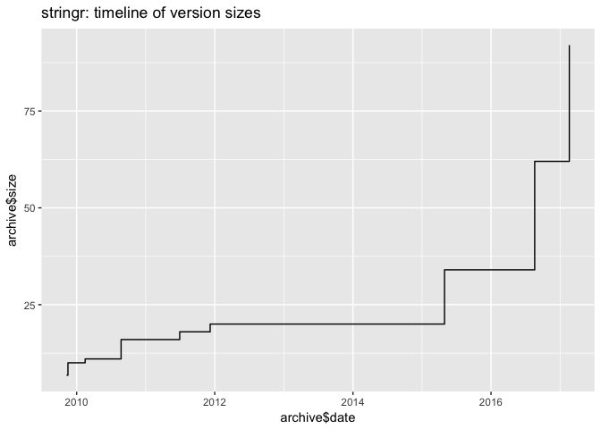
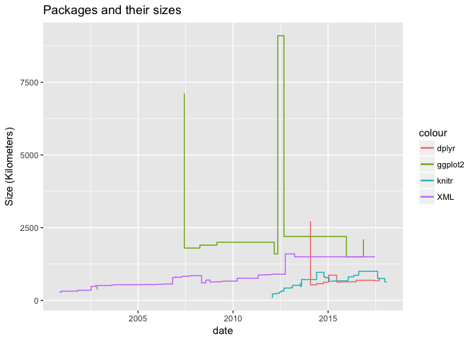
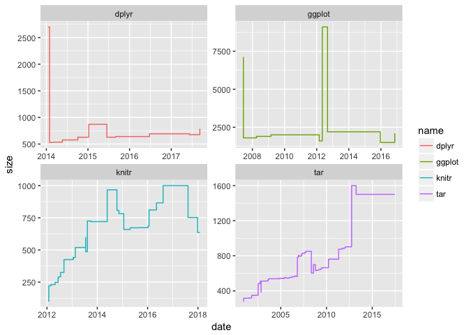
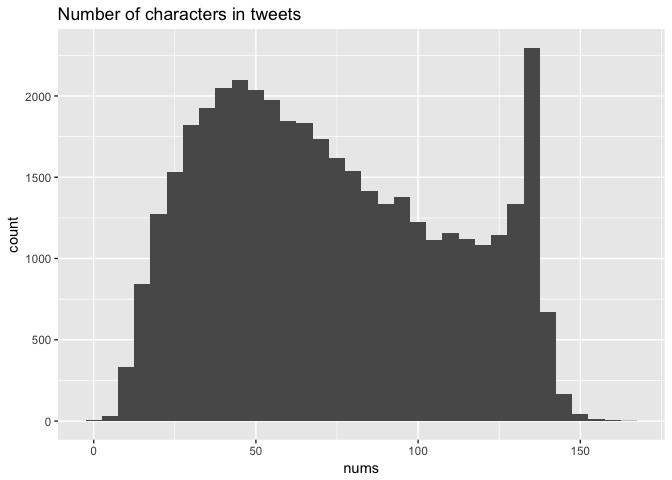
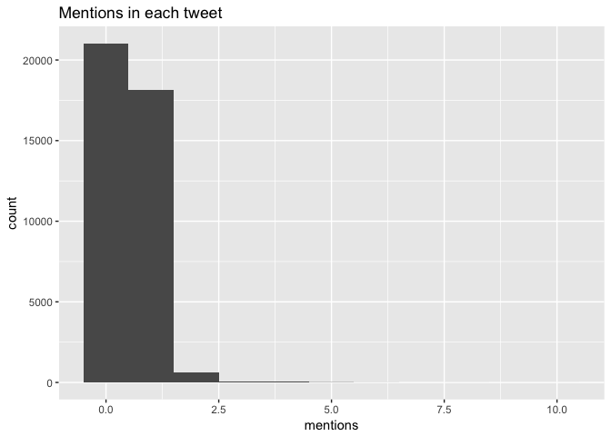
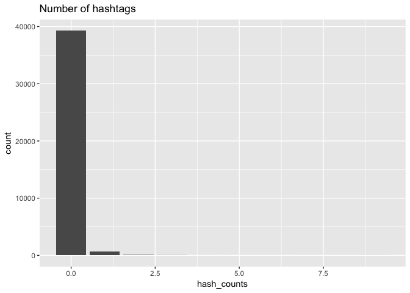

hw04-ian-driscoll
================

1. Archive of an R Package
--------------------------

``` r
source('../code/archive-functions.R')
library(ggplot2)
library(stringr)
raw_data = read_archive('stringr')
clean_data = clean_archive(raw_data)
plot_archive(clean_data)
```



``` r
#ggplot2
raw_gg = read_archive('ggplot2')
clean_gg = clean_archive(raw_gg)
write.csv(clean_gg, "../data/ggplot2-archive.csv")

#XML
raw_xml = read_archive('XML')
clean_xml = clean_archive(raw_xml)
write.csv(clean_xml, "../data/XML-archive.csv")

#knitr
raw_knitr = read_archive('knitr')
clean_knitr = clean_archive(raw_knitr)
write.csv(clean_knitr, "../data/knitr-archive.csv")

#dplyr
raw_dplyr = read_archive('dplyr')
clean_dplyr = clean_archive(raw_dplyr)
write.csv(clean_dplyr, "../data/dplyr-archive.csv")

ggplot() +
  geom_step(aes(x = clean_dplyr$date, y = clean_dplyr$size, col = 'dplyr')) +
  geom_step(aes(x = clean_knitr$date, y = clean_knitr$size, col = 'knitr')) +
  geom_step(aes(x = clean_gg$date, y = clean_gg$size, col = 'ggplot2')) +
  geom_step(aes(x = clean_xml$date, y = clean_xml$size, col = 'XML')) +
  xlab("date") +
  ylab("Size (Kilometers)") +
  ggtitle("Packages and their sizes")
```



``` r
all_together = rbind(clean_dplyr, clean_gg, clean_knitr, clean_xml)

ggplot(all_together) + geom_step(aes(x = date, y = size, col = name)) + facet_wrap(~name, scales = "free")
```



2. Regex Functions
------------------

``` r
source('../code/regex-functions.R')
```

    ## 
    ## Attaching package: 'dplyr'

    ## The following objects are masked from 'package:stats':
    ## 
    ##     filter, lag

    ## The following objects are masked from 'package:base':
    ## 
    ##     intersect, setdiff, setequal, union

``` r
split_chars('Go Bears!')
```

    ## [1] "G" "o" " " "B" "e" "a" "r" "s" "!"

``` r
split_chars("Expecto Patronum")
```

    ##  [1] "E" "x" "p" "e" "c" "t" "o" " " "P" "a" "t" "r" "o" "n" "u" "m"

``` r
vec = c('G', 'o', ' ', 'B', 'e', 'a', 'r', 's', '!')
num_vowels(vec)
```

    ## x
    ## a e i o u 
    ## 1 1 0 1 0

``` r
count_vowels('The quick brown fox jumps over the lazy dog')
```

    ## x
    ## a e i o u 
    ## 1 3 1 4 2

``` r
count_vowels("THE QUICK BROWN FOX JUMPS OVER THE LAZY DOG")
```

    ## x
    ## a e i o u 
    ## 1 3 1 4 2

``` r
reverse_chars("gattaca")
```

    ## [1] "acattag"

``` r
reverse_chars("Lumox Maxima")
```

    ## [1] "amixaM xomuL"

``` r
reverse_words("sentence! this reverse")
```

    ## [1] "reverse this sentence!"

``` r
reverse_words("string")
```

    ## [1] "string"

3. Data "Emotion in Text"
-------------------------

``` r
source('../code/regex-functions.R')
library(ggplot2)
dat = read.csv('../data/text-emotion.csv', sep = ",")
```

### 3.1

``` r
library(ggplot2)
content = as.character(dat$content)
nums = nchar(content)
summary(nums)
```

    ##    Min. 1st Qu.  Median    Mean 3rd Qu.    Max. 
    ##    1.00   43.00   69.00   73.41  103.00  167.00

``` r
ggplot() + 
  geom_histogram(aes(x = nums), binwidth = 5) +
  ggtitle("Number of characters in tweets")
```



### 3.2

``` r
ats = c(rep(0, length(content)))
for (i in 1:length(content)) {
  ats[i] = str_extract_all(content[i], "@+[0-9,a-z,A-Z,_]{1,15}")
}
mentions = as.integer(summary(ats)[,1])
table(mentions)
```

    ## mentions
    ##     0     1     2     3     4     5     6     7     8     9    10 
    ## 21043 18162   649    86    34    16     5     1     2     1     1

``` r
ggplot() +
  geom_bar(aes(x = mentions), width = 1) +
  ggtitle("Mentions in each tweet")
```



``` r
content[mentions == 10]
```

    ## [1] "last #ff  @Mel_Diesel @vja4041 @DemonFactory @shawnmcguirt @SEO_Web_Design @ChuckSwanson @agracing @confidentgolf @tluckow @legalblonde31"

### 3.3

``` r
hashes = c(rep(0, length(content)))
for (i in 1:length(content)) {
  hashes[i] = str_extract_all(content[i], "#+[a-z,A-Z]{1}+[a-z,A-Z,0-9]{0,15}")
}
hash_counts = c(as.integer(summary(hashes)[,1]), 1:9)
tab_hash = table(hash_counts) - 1
ggplot() +
  geom_bar(aes(x = hash_counts)) +
  ggtitle("Number of hashtags")
```



``` r
tags = unlist(hashes)
tags_without_hash = gsub("#", "", tags)
hash_lengths = nchar(tags_without_hash)
mean(hash_lengths)
```

    ## [1] 7.565267

``` r
table(hash_lengths)
```

    ## hash_lengths
    ##  1  2  3  4  5  6  7  8  9 10 11 12 13 14 15 16 
    ##  2 71 74 96 75 59 69 78 96 53 53 62 20 22 26 25

From the table, we can see that the mode is both 4 and 9, with 96 occurrences each.
