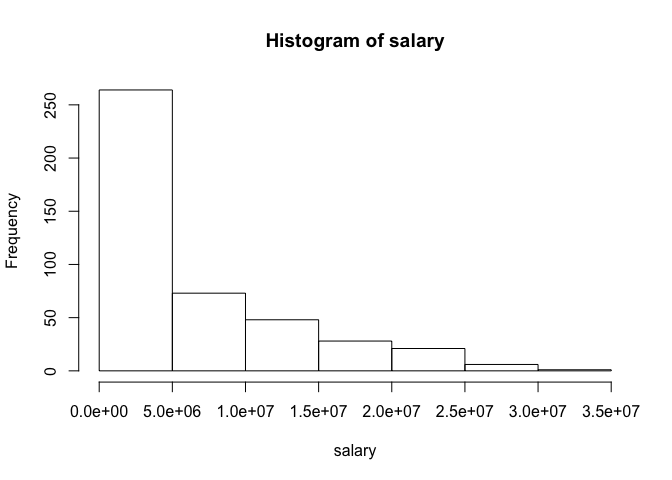
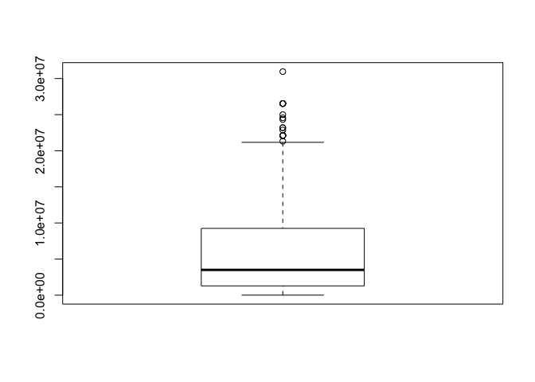
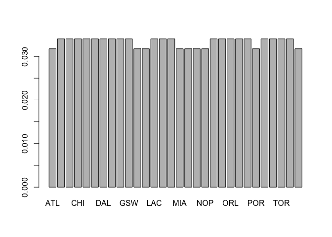
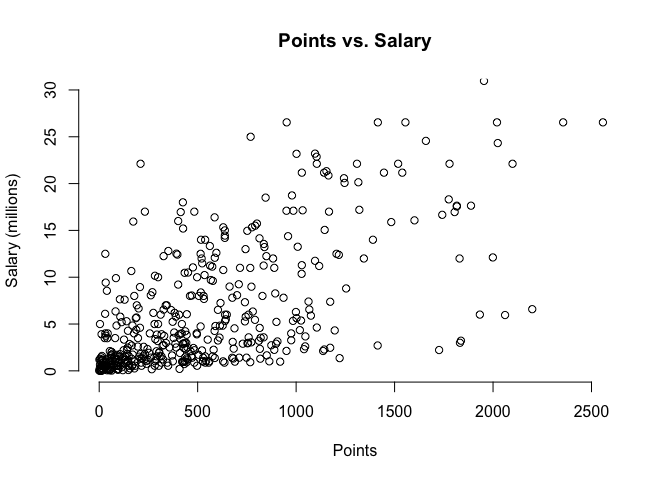

Warm-Up 2 Ian Driscoll
================

``` r
load("nba2017-salary-points.RData")
```

### Salary Miscellaneous Information

``` r
salary_millions = salary / 1000000
pos_fac = as.factor(position)
levels(pos_fac) = c("center", "power_fwd", "point_guard", "small_fwd", "shoot_guard")
summary(pos_fac)
```

    ##      center   power_fwd point_guard   small_fwd shoot_guard 
    ##          89          89          85          83          95

``` r
summary(salary)
```

    ##     Min.  1st Qu.   Median     Mean  3rd Qu.     Max. 
    ##     5145  1286160  3500000  6187014  9250000 30963450

``` r
mean(salary)
```

    ## [1] 6187014

``` r
sd(salary)
```

    ## [1] 6571890

``` r
min(salary)
```

    ## [1] 5145

``` r
max(salary)
```

    ## [1] 30963450

``` r
quantile(salary)
```

    ##       0%      25%      50%      75%     100% 
    ##     5145  1286160  3500000  9250000 30963450

The typical values for salary are centered around 6.2 million, and it is skewed to the right. For salary, there are a few outliers above 20 million. The histogram and boxplot are displayed below.

``` r
hist(salary)
```



``` r
boxplot(salary)
```



### Team Information

``` r
table(team)
```

    ## team
    ## ATL BOS BRK CHI CHO CLE DAL DEN DET GSW HOU IND LAC LAL MEM MIA MIL MIN 
    ##  14  15  15  15  15  15  15  15  15  15  14  14  15  15  15  14  14  14 
    ## NOP NYK OKC ORL PHI PHO POR SAC SAS TOR UTA WAS 
    ##  14  15  15  15  15  15  14  15  15  15  15  14

``` r
freq = table(team) / length(team)
freq
```

    ## team
    ##        ATL        BOS        BRK        CHI        CHO        CLE 
    ## 0.03174603 0.03401361 0.03401361 0.03401361 0.03401361 0.03401361 
    ##        DAL        DEN        DET        GSW        HOU        IND 
    ## 0.03401361 0.03401361 0.03401361 0.03401361 0.03174603 0.03174603 
    ##        LAC        LAL        MEM        MIA        MIL        MIN 
    ## 0.03401361 0.03401361 0.03401361 0.03174603 0.03174603 0.03174603 
    ##        NOP        NYK        OKC        ORL        PHI        PHO 
    ## 0.03174603 0.03401361 0.03401361 0.03401361 0.03401361 0.03401361 
    ##        POR        SAC        SAS        TOR        UTA        WAS 
    ## 0.03174603 0.03401361 0.03401361 0.03401361 0.03401361 0.03174603

``` r
barplot(freq)
```

 Each team has either 14 or 15 players, and the distribution is uniform, with each relative frequency around 3%.

### Scatterplot of Points and Salar

``` r
plot.new()
plot.window(c(0, 2600), c(0, 30))
axis(1, labels = TRUE)
axis(2, labels = TRUE)
title(main = "Points vs. Salary", xlab = "Points", ylab = "Salary (millions)")
points(points, salary_millions)
```



### Finding Correlation Between Points and Salary

``` r
# First we must find the mean of each vector.
mean_points = sum(points) / length(points)
mean_salary = sum(salary_millions) / length(salary_millions)
# Next comes calculating the standard deviations.
sd_salary = sqrt((sum((salary_millions - mean_salary) ^ 2)) / (length(salary_millions) - 1))
sd_points = sqrt((sum((points - mean_points) ^ 2)) / (length(points) - 1))
# We also must find covariance.
cov_pts_salary = sum((points - mean_points) * (salary_millions - mean_salary)) / (length(points) - 1)
#Plugging all of our values into our correlation formula gives us our answer.
cor_pts_salary = cov_pts_salary / (sd_points * sd_salary)
cor_pts_salary
```

    ## [1] 0.6367043

### Comments and Reflections

-   Formatting Markdown was stil pretty tedious, the syntax will just take some getting used to.
-   Assigning values and coming to the correlation manually was pretty simple for me.
-   I did not need any help for this assignment other than quick google searches for R commands.
-   This assignment took me about 2 hours in total.
-   The most time consuming part was formatting the Markdown file.
-   I understood everything pretty well.
-   Nothing was super frustrating in particular, other than my lack of comfort with Markdown syntax.
